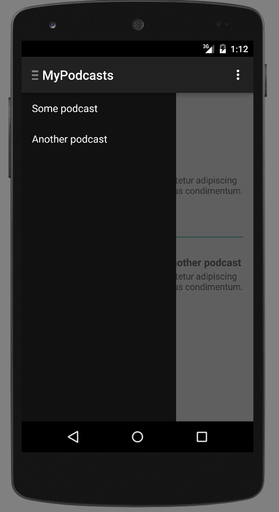
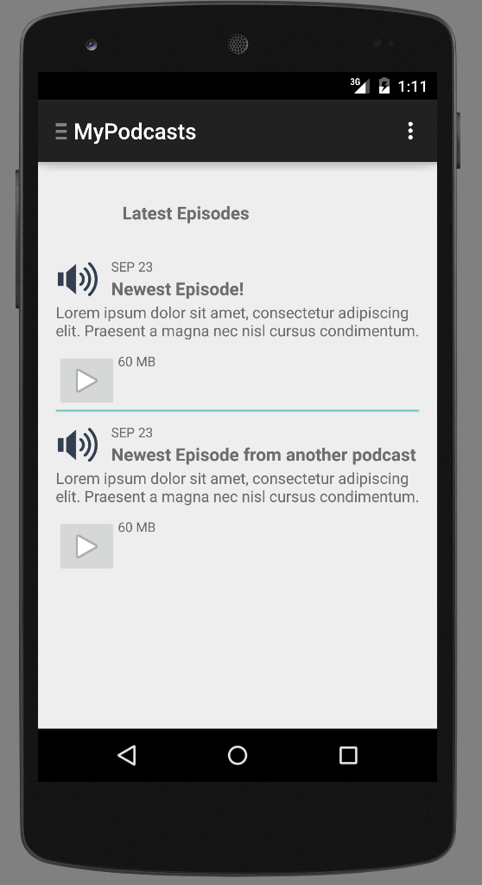
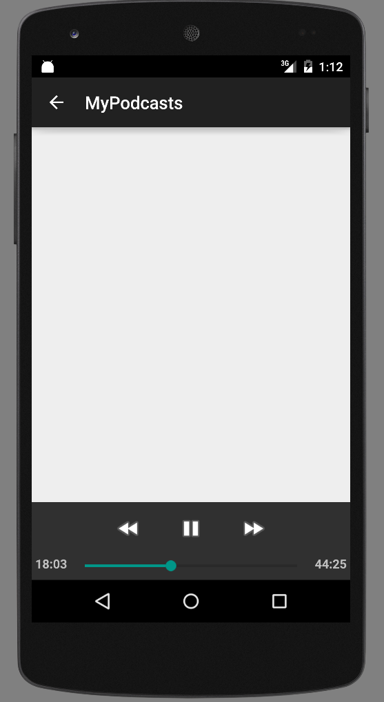
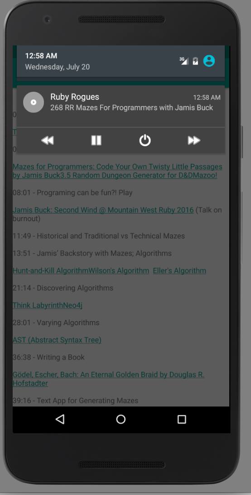

# mypodcasts-android

[](https://travis-ci.org/alabeduarte/mypodcasts-android)
[](https://github.com/alabeduarte/mypodcasts-android/blob/mypodcasts-android/LICENSE.txt)

Podcast client for android.

Let's make a good app to listen our favorite podcasts with all amazing features that we imagine for free!






## Download the APK
The APK is available [here](https://github.com/alabeduarte/mypodcasts-android/releases)

## Contributing:
I have a set of features to be worked and I plan to make them available as soon as possible which are:

* Fix orientation change bug on audio playing.
* Download Complete Feedback.
* Feed search (using [mypodcasts-api](https://github.com/alabeduarte/mypodcasts-api) on top of some existing API that retrieves those). 
 
Some of this [issues](https://github.com/alabeduarte/mypodcasts-android/issues) are listed already, so any help will be well received.

## Running tests:
I strongly recommend to use [Android Studio](http://developer.android.com/sdk/index.html) for a smooth integration, but follow the command below if you wanna run all unit tests on your own environment:

```
$ ./gradlew test
```

### Known issues with Android Studio

Some actions need to be taken by if you face this error below when trying to run the tests locally through Android Studio:

```
java.io.FileNotFoundException: build/intermediates/bundles/debug/AndroidManifest.xml (No such file or directory)
	at java.io.FileInputStream.open0(Native Method)
	at java.io.FileInputStream.open(FileInputStream.java:195)
	at java.io.FileInputStream.<init>(FileInputStream.java:138)
	at org.robolectric.res.FileFsFile.getInputStream(FileFsFile.java:78)
	at org.robolectric.manifest.AndroidManifest.parseAndroidManifest(AndroidManifest.java:130)
	at org.robolectric.manifest.AndroidManifest.getTargetSdkVersion(AndroidManifest.java:480)
	at org.robolectric.RobolectricTestRunner.pickSdkVersion(RobolectricTestRunner.java:380)
	at org.robolectric.RobolectricTestRunner.runChild(RobolectricTestRunner.java:173)
	at org.robolectric.RobolectricTestRunner.runChild(RobolectricTestRunner.java:63)
	at org.junit.runners.ParentRunner$3.run(ParentRunner.java:290)
	at org.junit.runners.ParentRunner$1.schedule(ParentRunner.java:71)
	at org.junit.runners.ParentRunner.runChildren(ParentRunner.java:288)
	at org.junit.runners.ParentRunner.access$000(ParentRunner.java:58)
	at org.junit.runners.ParentRunner$2.evaluate(ParentRunner.java:268)
	at org.robolectric.RobolectricTestRunner$1.evaluate(RobolectricTestRunner.java:140)
```

Set the `Working directory` with the variable `$MODULE_DIR$` and it should be fine.
More details about this issue can be followed on [robolectric#1648](https://github.com/robolectric/robolectric/issues/1648).

## Running locally with stubbed service

As we don't have any API live yet, there is a stub that return some feeds for local tests purposes.

- Install [nodejs](https://nodejs.org/)
- Run stub:
```
$ ./stub.sh
```

Once the server is up, you can run your app normally as a regular android project.

Take a look at the backend API [mypodcasts-api](https://github.com/alabeduarte/mypodcasts-api) if you want to contribute in there as well.
